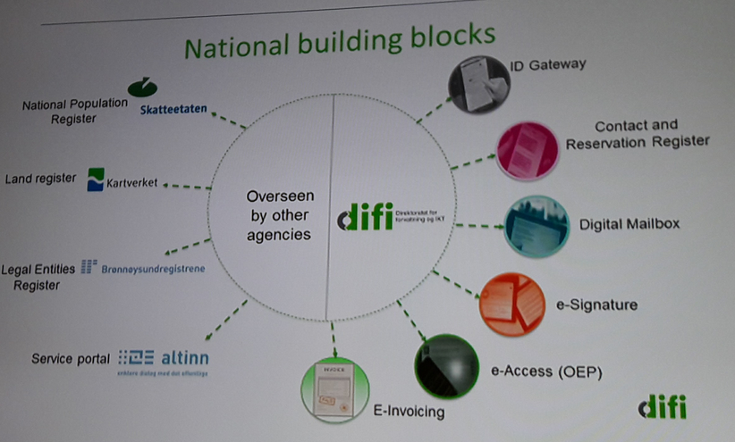

# 1.6 IT arhitektuur

__Ehitusblokid__, ingl _building blocks_ on IT arhitektuuri kujundamise viis, kasutusel eelkõige suurtes süsteemides. Kavandatakse ja teostatakse rida komponente - "ehitusblokke" (taristulisi teenuseid), pöörates erilist tähelepanu komponentide kokkusobivusele (koostalitlusvõimele, ingl _interoperability_). Komponte kombineerides saab paindlikult ja kuluefektiivselt teha erinevaid lahendusi ja teenuseid.

Ehitusblokkide arhitektuuripõhimõte on kasutusel mitmete riikide rahvuslike e-taristute ehitamisel:

- Norra rahvusliku e-taristu ehitusblokid

- Soome [National Architecture for Digital Services](https://esuomi.fi/?lang=en)
- Euroopa Liidu piiriülese e-taristu ehitusblokid: [CEF building blocks](https://ec.europa.eu/cefdigital/wiki/display/CEFDIGITAL/CEF+building+blocks).

Ehitusblokkide arhitektuurile on rajatud ka suured pilveplatvormid, nt:

- [IBM Bluemix](https://www.ibm.com/cloud-computing/bluemix/)
- [Google Cloud](https://cloud.google.com/)
- [Amazon Web Services](https://aws.amazon.com/)

__IT-arhitektuuri kirjeldamine__

[“C4” meetod](http://static.codingthearchitecture.com/c4.pdf) 

Simon Brown (2015) [Communicating software architecture with sketches, diagrams and the C4 model](https://leanpub.com/visualising-software-architecture/read#leanpub-auto-sketches-diagrams-models-and-tooling)
