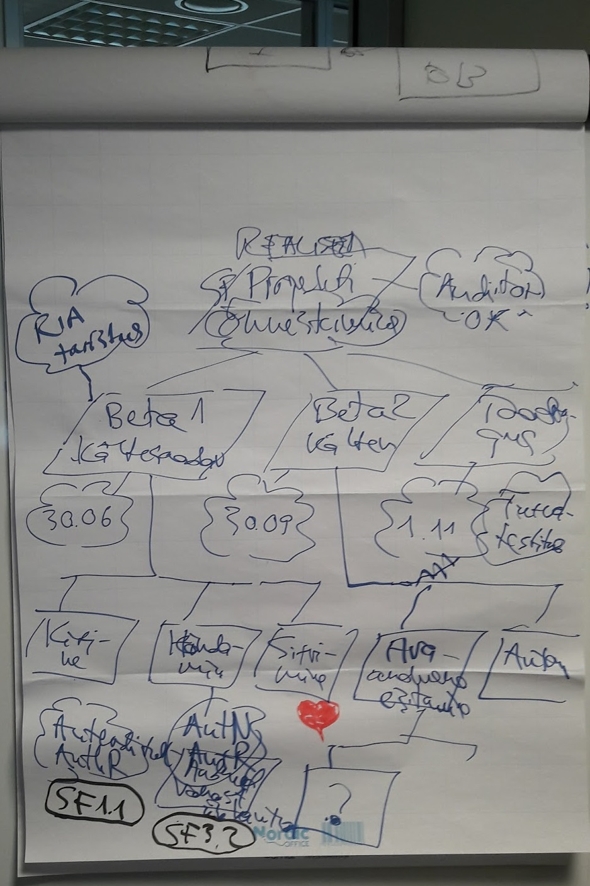

## Fookusmudel

_"Omanikul võiks olla infosüsteemi eesmärk väga selge"_ -- RIHA võrgustiku seminari 25.05.2017 rühmatöö "Mida hindajad ootavad omanikelt?" kokkuvõttest

Fookusrežiim
Drifting mode Uitlemisrežiim
Exploration mode

Kas inimene (tiim, asutus) peaks kogu aeg olema fookusrežiimis?

Eesmärgipuu

*Hierarhia*. Eesmärgid tuleb seada hierarhiasse. Hierarhia ülemine tipp on kõige tähtsam, peaeesmärk. Peaeesmärke saab olla ainult üks.

- Hierarhiline esitus ei tähenda, et reaalsus ise oleks hierarhiline. Reaalsus ei ole hierarhiline. Reaalsus on pigem võrkjas või üldse hägune. Hierarhia on reaalsusele peale surutud vorm.
- Hierarhia eesmärk on jõuda produktiivse tegutsemiseni. Eesmärkide hierarhia ei taga optimaalsust, kuid annab sageli parima või vähemalt hea sihi ja suuna tegutsemisele.

*Markeering*. Eesmärgi positsioon eesmärgipuus väljendab seda, kas ja kuidas eesmärk toetab kõrgema eesmärgi saavutamist. Lisaks sellele on enamasti kasulik eesmärke kategoriseerida veel teisteski vaadetes.

*Kvaliteedieesmärk* (_Quality Goal_) on ligikaudu võrdne mittefunktsionaalse nõudega.

*Edevuseesmärk* (_Vanity Goal_) on puus koha sissevõtnud eesmärk, mille tegelik motiiv on peaeesmärgist kõrvale minev. Nt uue tehnoloogia katsetamine (kui see ei ole projekti peaeesmärk), arendajast ühe või teise kuvandi loomine jms.

Operatsioonid eesmärgipuuga

Suureks kasvanud puud tuleb kärpida.

*Pinnale tõusmine* (_bubbling up_), eesmärgi nihkumine puus ülespoole. (Vrdl Javascript event bubbling and capturing).

*Kärpimine*. Ülekoormatud okse mahalõikamine. 

<i class="ikoon material-icons" style='color: #F48FB1;'>favorite</i>

*Tegevuseni viimine* (_Operationalisation_) saavutatakse sellega, et eesmärkmudel viiakse välja selgepiiriliste tegevusteni (süsteemiarenduses - kasutuslugudeni).