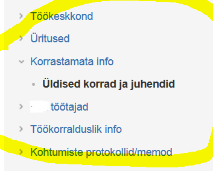

# 2.1 Infohaldus (Information Management)
{: .no_toc}

- TOC
{:TOC}

Oskused

- oskab korraldada info liikumist organisatsioonis organisatsiooni eesmärkidest lähtuvalt
  - reeglid, klassifikatsiooniskeemid
  - kommunikatsioonikanalite valik

<i class="material-icons ikoon">help_circle</i>Ettevõte võib suhelda klientidega mitmete kanalite kaudu (üks või mitu erinevat veebiliidest, e-post, sotsiaalmeedia, trükimeedia jne). Kas peaks olema nn "kanalistrateegia" ja mida see peaks sisaldama?

[Isakson, B (2003) The Art of Information Management for Project Managers](http://www.architectronica.com/download/ArtInfo.pdf)

IT mõjutab organisatsioone mitmel tasandil.

__Globaalsel tasandil__ põhjustab IT areng tervete majandusharude tekkimist ja kadumist. Kas inimesed kaotavad robotite ja tehisintellekti tõttu töö? Iseliikuvate autode levik tähendab miljonite juhtide - ja ahelreaktsioonina ka näiteks sõiduõpetajate - kadu.

__Riigi tasandil__ on väljakutseks kujundada ja teoks teha  poliitikad, mis lubaksid riigimasinat IT abil odavalt ülal pidada ja riigi IT firmadel kasvada.

__Ettevõtte strateegia tasandil__ on küsimus ettevõtte suutlikkuses leida optimaalne IT konfiguratsioon, saavutades selle läbi parema positsiooni konkurentsivõitluses.

__Infosüsteemi tasandil_ peab organisatsioon süsteemi välja arendama ja muutuvas tehnoloogilises ning ärilises keskkonnas ajakohasena hoidma sobiva hulga süsteeme. Näiteks:

- raamatupidamissüsteem
- kliendihaldussüsteem
- veebileht
- e-pood
- personalisüsteem
- projektijuhtimissüsteem
- laoarvestussüsteem
- ettevõtte terviksüsteem (_ERP, Enterprise Resource Planning_).

Kuid IT ei piirdu rangelt reglementeeritud infosüsteemidega. 

Suur osa organisatsiooni infotöötlusest toimub töötaja ja tiimi tasandil erinevate infotöö- ja kommunikatsioonivahendite abil. Näiteks:

- Skype
- sisevõrgu ühisketta kaustad
- siseveebi
- organisatsiooni e-posti süsteem
- kalendri- ja ajaplaanimissüsteem (nt Outlook)
- nn _Productivity Software_ (nt Microsoft Office).

Olulist osa nendest vahenditest võidakse kasutada __pilveteenustena__.  

Efektiivse töö saavutamiseks ei piisa tarkvara ostmisest või pilveteenuse rentimisest. IT-vahendeid tuleb tundma õppida ja kohandada ettevõtte vajadustele.

Sageli ei suudeta ostetud tarkvara ja süsteeme efektiivselt kasutada. Süsteemide omadustest suudetakse kasutusele võtta ainult osa. Näiteks:

- organisatsioon on ostnud kalli ja võimsa siseveebi (intraneti) tarkvara, kuid selles ei suudeta teavet organiseerida. Lehekülgedes ja kaustades pole süsteemi, teave ei ole ülesleitav, oluline teave ja "läbu" on segamini, valitseb kaos.
- organisatsioon püüab sisekommunikatsiooni parandada (seda vajadust toob igal aastal välja töötajate rahulolu-uuring), võttes kasutusele uue viki. Olukord aga ei taha paraneda. 
- projektidokumentatsioon ei ole ülesleitav. See on ohuks, kui mõne projektijuhiga peaks midagi juhtuma.
- paljusid asju organisatsioonis üldse ei dokumenteerita, kuigi peaks; see on takistuseks igapäevasele tööle ja võib mõjutada ka tootearendust ja strateegilist juhtimist 

Tihti kohtame sedagi, et töötajatel on võimsad ja tänapäevased infotehnoloogilised töövahendid, töö efektiivsus aga on madal. Palju aega kulub teabe otsimisele, edastamisele, üleküsimisele ja -kinnitamisele.

Mis on nende nähtuste põhjuseks? Üheks põhjuseks on kindlasti ka see, et info töötlemist ei käsitata terviklikult. Tähelepanu all on tarkvara ja suurte süsteemide ostmine; tähelepanu alt välja jäävad infotöötluse korraldamine mikrotasandil ja heade infohalduspõhimõtete rakendamine.

See nähtused on viinud selleni, et viimasel ajal on hakatud rõhutama tervikliku infohalduse (_Information Management_, ka _Information Governance_) vajalikkust.

<i class="material-icons ikoon">help_circle</i>Ettevõte tegutseb konsultatiivse, projektimüügiga. Juhataja tahab, et kogu suhtlus klientidega saaks fikseeritud. Kuidas seda saavutada?

Lahenduseks võib olla kliendihaldussüsteemi (CRM-süsteemi, _Customer Relationship Management_) hankimine. Mõneski firmas võib see olla parim lahendus. Samas on palju organisatsioone, kus ühe süsteemi hankimisega nii suurt probleemi ära ei lahenda. Seda mitmel põhjusel. Teavet võib olla nii palju ja suhtlust läbi nii paljude kanalite, et kogu informatsiooni hõlmamine ühtsesse süsteemi ei ole praktiliselt võimalik. Ja isegi kui see saavutatakse, peab teave olema ülesleitav.Teine moment on olulise eristamine ebaolulisest. Juhataja ei väljenda end päris täpselt. Teda ei huvita kõikvõimalik teave, vaid ikkagi ainult oluline teave. Olulisus tähendab aga erinevatele inimestele erinevatel aegadel erinevaid asju. Info nappusest võib niiviisi jõuda väheolulise teabe ülekülluseni.

Infohalduse terminoloogia ja põhimõtete kohta on hea eestikeelne materjal PriceWaterhouseCoopersi 2014. a Majandus- ja Kommunikatsiooniministeeriumi tellimusel koostatud riigi infohalduse strateegia kavand.

PriceWaterhouseCoopers (2014) [Dokumendihalduselt infohaldusele](https://www.mkm.ee/sites/default/files/dokumendihalduselt_infohaldusele_strateegia_1.9.pdf). Strateegia kavand.

__Terviklik infohaldus__ on tugifunktsioon/tegevus/protsess, mis aitab toime tulla infovoogudega. 

Organisatsiooni infohaldus on „katus“ sisuhaldusele (_Content Management_), dokumendihaldusele, infotöötlusele infosüsteemides jne.

Hästi korraldatud infohaldus on loov infohaldus, mis:

- katab/käsitleb/töötleb/filtreerib mis tahes kujul ja mis tahes allikast pärinevat ning mis tahes kanali kaudu saadud/
saadetavat informatsiooni ,
- filtreerib/korrastab/talletab ning säilitab infot ja selle konteksti lähtudes info väärtusest ja tagades selle kvaliteedi,
- eraldab,  koondab,  süstematiseerib  ja  esitab  infot  lähtudes  konkreetsest  kasutajast

Hästi korraldatud infohaldus teeb info leidmise ja kasutamise võimalikult lihtsaks ning sellega võimaldab kiiresti langetada õigeid otsuseid, kindlustades organisatsiooni i eesmärkide tõhusa ja tulemusliku täitmise.

__Kuidas seda saavutada?__

- määratledes, milline info on nii väärtuslik, et seda hallata
- lihtsustades info talletamist ja muutes selle võimalikult automaatseks
- tagades info säilimise nii kaua, kui seda vajatakse
- tagades kontekstiinfo säilimise ja sidumise (metaandmed, kirjeldused jms)
- vähendades struktureerimata infot struktureeritud info kasuks
- vähendades traditsiooniliste dokumentide hulka
- tagades tõendamisega seotud riskide maandamise IT süsteemide andmete abil
- mõeldes ka inimeste teadmistes ja kogemustes talletatud info säilimisele/kasutamisele.

__Võtteid infohalduse parendamiseks

Ülalesitatud põhimõtted võivad tunduda liiga üldised, et neist praktilist kasu oleks. Siiski, kui mõtleme, mis on organisatsiooni infohalduses tegelikud kitsaskohad ja kuidas neid lahendada, siis leiab põhimõtetest küll tuge.

<i class="material-icons ikoon">help_circle</i><b>Dokumentide arvu vähendamine</b>. Mõelge mõnele oma projektile või korduvale toimingule. Loendage dokumendid, mis selles tekivad. Kas dokumentide arvu saaks vähendada (võib-olla lähedase funktsiooniga dokumente ühitades või mõnda isegi ära jättes), ilma, et töö kvaliteet kannataks?

<i class="material-icons ikoon">help_circle</i><b>Teabe prioritiseerimine</b>. Loetlege kümmekond dokumendi- või teabetüüpi, millega tööl kokku puutute. Prioritiseerige need dokumenditüübid. Leidke 2-3 kõige tähtsamat, olgu need kategooria A; määrake kategooria B (olulised) ja C (väheolulised) dokumendi.

<i class="material-icons ikoon">help_circle</i><b>E-posti asendamine efektiivsema kanaliga</b>. Mõned IT idufirmad on loobunud e-posti kasutamiseks organisatsiooni sisesuhtluses, väites, et e-post on ebaefektiivne. Selle asemel kasutatakse <a href='https://slack.com/'>Slack-i</a> vm vahendeid. Kas teie organisatsioonis kasutatakse palju e-posti? Kas osa e-postiga vahetatavast teabest võiks käia mõne teise kanali kaudu?

<i class="material-icons ikoon">help_circle</i><b>Failinimede süsteem</b>. Kas teie organisatsioonis hoitakse teavet failidena? Koostage põhimõtete süsteem failinimede valikuks.

<i class="material-icons ikoon">help_circle</i><b>Kaustade süsteem</b>. Teie organisatsioon tegeleb projektidega? Koostage kaustade tüüpskeem projektidokumentatsiooni hoidmiseks.

__Mis takistab?__

Mis takistab infohalduse ideaali saavutamist? Takistada võivad muu hulgas:

- töötaja, kelle infotöötlus on ebaefektiivne, on _busy_, väliselt näib, nagu teeks ta palju tööd. Seevastu töötajal, kes on oma teabe efektiivselt korraldanud, pole vajadust tormakat tegevust arendada. Kumba organisatsioonis rohkem hinnatakse?
- infohalduse parendused võivad olla väikesed, pikaajalise tagasitootmisajaga, raskesti järgitavad

## Kanalistrateegia

Artikli TL;TR

Bang et al (2013) Channel capabilities, product characteristics, and the impacts of mobile channel introduction. Journal of Management Information Systems.

Artiklis konstrueeritakse loogiline ja lihtne mudel, mille abil uuritakse tarbija käitumist online- ja mobiilikanali vahel valimisel. Tehingu või ostu ajakriitilisus, tooteteabe intensiivsus. Kanalikonflikt, kanalikannibalism. Viited varasematele uuringutele.

<i class="material-icons ikoon">help_circle</i>Milliseid infoallikaid ja millises proportsioonis tuleks kasutada, et IT arengutega kursis olla?

<i class="material-icons ikoon">help_circle</i>Kas kasutad Twitterit? Kui kasutaksid, siis mis põhimõtte või -mõtete järgi võiks valida jälgitavad isikud?

Näide

__Personaalne infostrateegia (näide)__

| infoallikas v- kanal  | kasutamine       |
|-----------------------|:----------------:|
| Hacker News              | oluline, tihe |
| IT blogid                | oluline, tihe (HN ja Google kaudu) |
| TLÜ/EBS artiklibaasid    | kasulik, aeg-ajalt    |
| Twitter (arvamusliidrid) | võiks rohkem, ei jõua |
| inimkontaktid            | 
| - kolleegid              | oluline, võiks rohkem? |
| - tudengid               | oluline               |
| raamatud                 | ei jõua               |
| firma koolitused         | ei osale              |
| konverentsid             | oluline               |
| IT videod                | oluline, nt [GOTO konverentside videod](https://www.youtube.com/user/GotoConferences), võiks rohkem |
| töö ise                  | oluline               |
| - ise kirjutamine        | oluline               |
| - ise blogimine          | peaks, ei jõua        |
| äriajakirjandus (Eesti)  | ei                    |
| IT veebiväljaanded       | ei jõua               |
| DevClub, Meetups jms     | oleks oluline         |

## Sisustrateegia

Sisustrateegia (_Content Strategy_) puhul on küsimus, kas see on üldse IT teema. Teemad ja mikroteemad, žanrid, erinevatele sihtrühmadele suunatud žanrikogumid, kooskõlalised, stiililiselt ühtsed sõnumid üle erinevate platvormide ja kanalite, mitmeplatvormiline sisutootmine...
 