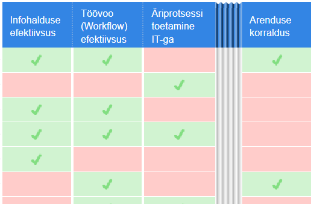

# 0.2 Kliendiküsitluse IT

<i class="material-icons ikoon">help_circle</i>Tahan välja selgitada, millised 5-6 kursuse fookuspunktidest on tudengitele kõige olulisemad. Millise tarkvaraga saan seda kõige lihtsamini teha?

Kandidaadid:

- [Doodle](https://doodle.com/free-online-voting)
- [Pivotal Tracker](https://www.pivotaltracker.com/)

Tarkvara ülevaade

[Best Survey Software | 2017 Reviews of the Most Popular Systems](http://www.capterra.com/survey-software/).

---

Olulist IT-printsiipi _Eat Your Own Dogfood_ (["koeratoitlus"](https://agiil.github.io/sonastik/#koeratoit)) järgides püüab kursus rakendada IT-d, tehes seda agiilselt.

Kliendivajaduste väljaselgitamine (_Customer Research_) on igas ettevõttes oluline protsess.

Mida tuleks selles protsessis IT rakendamisel silmas pidada? Protsess peab:

- olema kliendile võimalikult vähe häiriv
- olema ettevõttele väikese kuluga
- tooma välja olulised vajadused, soovitavalt prioritiseeritult
- seostuma ettevõtte ressursside ja valitud strateegiaga.

Ülikooli kursus on suures osas __infotoode__, s.t tähtsusetu ei ole mida õpetatakse. Kuna mõnes mõttes võib kursust käsitada infosüsteemina, siis on tegu __[infovajaduste väljaselgitamisega](IT/Nouded)__.

