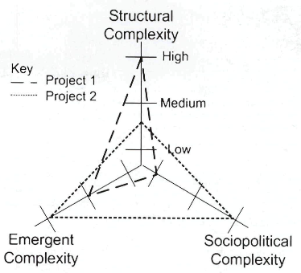
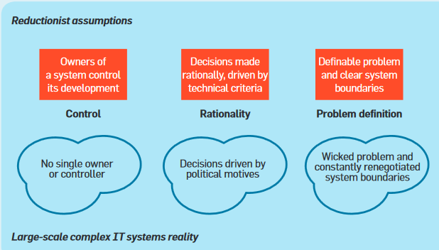

# 1.8 Lihtne ja keeruline IT

Oskab

- ära tunda keerukust ja seda juhtida
- leida lihtsaid lahendusi

 

Allikas: Maylor H (2013) How Hard Can It Be? Actively Managing Complexity in Technology Projects. Research-Technology Management.

Flinders, K (2015) Simplicity for the Business Means Complexity for IT. Computer Weekly.

<i class="material-icons ikoon">help_circle</i>Mis teie meelest on IT-s keerukas? 
 
nt (lihtsamast alustades): 
projektori ühendamine arvutiga – õige režiimi leidmine 
igasugune telekonverents 
VPN-i töölesaamine 
juhtmete lahti- ja külgeühendamine töökoha ümbertõstmisel 
dokumentide ülesleidmine ühiskettalt 
Regex on keerukas 

Märkus. [Regex](https://en.wikipedia.org/wiki/Regular_expression) (regular expression) on võimas ja kompaktne, aga suhteliselt raskesti õpitav mustrikeel. Paljude programmeerimiskeelte (nt Javascript, Python) osa. Üks parimaid Regexi selgitusi on [Pythoni dokumentatsioonis](https://docs.python.org/2/library/re.html).

<i class="material-icons ikoon">help_circle</i>Vali IT projekt või infosüsteem ja ürita hinnata selle keerukust? 
Variant: kahe projekti või süsteemi võrdlus keerukuse vaatepunktist.

Artikli TL;DR

Holub, I et al (2016) Measuring Complexity of SAP Systems. Complex Systems Informatics and Modeling Quarterly. 

Tarkvara

[LeanKit](https://leankit.com/), _Lean_ põhimõtteid järgiv visuaalne projektijuhtimise ja töövoosüsteem

__Lihtsaim IT__

- "Hello, World!" - traditsiooniline [kõige lihtsam IT-rakendus](https://en.wikipedia.org/wiki/%22Hello,_World!%22_program).
- To-Do rakendus

__"not capable of simple"__

> "Eran Hammer resigned his role of lead author for the OAuth 2.0 project, withdrew from the IETF working group, and removed his name from the specification. Hammer pointed to a conflict between the web and enterprise cultures, citing the IETF as a community that is "all about enterprise use cases", that is "not capable of simple." What is now offered is a blueprint for an authorization protocol, he says, and "that is the enterprise way", providing a "whole new frontier to sell consulting services and integration solutions." --- http://en.wikipedia.org/wiki/OAuth#Controversy

Allikas: Sommerville, I et al (2012) Large-Scale Complex IT Systems. Communications of the ACM. 

[Üliõpilase kood](img/Koodid.PNG)

Inimene ei vaja [122+ viisi filtrite loomiseks](img/Jira.PNG) (Jira).

Jira ja Trello kohta vt ka [https://techcrunch.com/2017/01/09/atlassian-acquires-trello/](https://techcrunch.com/2017/01/09/atlassian-acquires-trello/).

- Lihtsuse saavutamine nõuab jõupingutust

- Lihtsus võib nõuda rohkem oskust kui keerukus
  - _One-liner_-i kirjutamine pole lihtne

__One-liner__. Programmeerimiskeeles Python on heaks programmeerimistavaks iga mooduli kirjeldamine üherealise tekstiga, nn [doctring-iga](https://www.python.org/dev/peps/pep-0257/). Üherealist programmikirjeldust, mis oleks informatiivne ja sisukas, ei olegi nii lihtne koostada! ([Python](https://www.python.org/) on huvitav mitte ainult kui populaarne programmeerimiskeel, vaid keele arenduse omapärase valitsemismudeli (_governance model_) poolest).

Lihtsuse hoidmine nõuab jõupingutust

Tehniline näide. HTTP2 on uus versioon põhilisest veebiprotokollist. HTTP2 on kiirem, kuid [sõnumid ei ole enam inimloetavad](https://news.ycombinator.com/item?id=9038613).

Siia üks väike võrdlus kõrvale:

agiilne (F-Secure näitel, 
http://www.sciencedirect.com/science/article/pii/S0950584914002043) 
RIA
- eepik (epic)
  - featuur (feature)
    - kasutuslugu (user story)
      - ülesanne (task)

eepik - high-level goal of the product for the multi-release time horizon
featuur – eepiku osa, mis teostatav ühe reliisitsükliga
kasutuslugu – featuuri osa, funktsionaalsuse väike tükk, kasutaja vaatepunktist
task – tehniline ülesanne, mida on vaja kasutusloo teostamiseks

Võtmesõna seejuures on reliis (release). 

On inimesi, kes reliisivad kord aastas või veel harvemini. Avaarenduse gurud Eric S. Raymond ja Martin Paljak aga ütlevad, et „Release early, release often“.

Millal sina viimati reliisisid?
  - strateegia
  - tööplaan
    - tegevuskava
      - arenduse iteratsioon
        - minihanke
          - etapp
            - tööpakett
              - omadus/nõue

reliis tüüpiliselt kord aasta-paari järel

- Paigaldamine on lihtne
- Konfigureerimine on lihtne
- Pääsuhaldus on lihtne

Ei ole lihtne?

