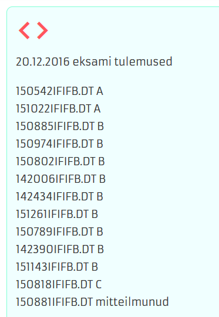

# Lihtne ja keerukas IT

not capable of simple

> "Eran Hammer resigned his role of lead author for the OAuth 2.0 project, withdrew from the IETF working group, and removed his name from the specification. Hammer pointed to a conflict between the web and enterprise cultures, citing the IETF as a community that is "all about enterprise use cases", that is "not capable of simple." What is now offered is a blueprint for an authorization protocol, he says, and "that is the enterprise way", providing a "whole new frontier to sell consulting services and integration solutions." &mdash; http://en.wikipedia.org/wiki/OAuth#Controversy

Üliõpilase kood

Inimene ei vaja 122+ viisi filtrite loomiseks (Jira).

Jira ja Trello kohta vt ka [https://techcrunch.com/2017/01/09/atlassian-acquires-trello/](https://techcrunch.com/2017/01/09/atlassian-acquires-trello/).

Lihtsuse saavutamine nõuab jõupingutust

Lihtsuse hoidmine nõuab jõupingutust

Tehniline näide. HTTP2 on uus versioon põhilisest veebiprotokollist. HTTP2 on kiirem, kuid [sõnumid ei ole enam inimloetavad](https://news.ycombinator.com/item?id=9038613).
