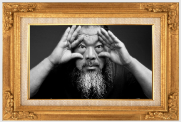

# IT õpetuse meetodi, suuna ja skoobi otsinguil


## IT koht ärihariduse kaanonis
 
IT koht ärihariduse kaanonis on muutumises. Traditsioonilises ainekavas, äri- ja juhtimisainete reas (_strategy_, _marketing_, _finance_, _operations_ jm) on IT (_Management Information Systems_ vm arhailisevõitu nime all) ikka tulnud lõpu poole. 

IT olemine toetavas rollis ei ole enam adekvaatne. Kui tarkvara arendusplaan on juba ühtlasi ka ettevõtte äriplaan (või selle oluline osa), siis on selge, et IT ei ole enam tugifunktsioon.

Kuid ei ole ka päris selge, mis suhe või roll IT õpetusel äri suhtes võiks olla. Kui tarkvara valmistamise ja juurutamise edukusest sõltub ettevõtte edukus, siis on tarkvaratehnilist ja äristrateegilist vaatenurka raske lahus käsitleda.

Äri ja tehnoloogia sümbioos ei saa aga olema kerge, ei kultuuriliselt ega mõtteviisiliselt.


# IT lubadus

Aastakümneid on IT-d näthud universaalse tehnoloogiana, mis võimaldab igasuguseid protsesse teha paremaks, kiiremaks, odavamaks.

Märksõnad on aastatega vahetunud, kuid lubadus on jäänud samaks. 

```
1980-ndad                            2016
real-time processing                 Industrial Internet
                                     Factory of the Future (FoF)
1990-ndad                            smart cities
information society                  smart living environments
information at your fingertips       driverless cars
complete information                 wearables
seamless integration                 mobile health, agro-food
information at the point of need     cyber physical systems
fully integrated enterprise          blockchain
glue that holds the company together software defined everything
company's nervous system (B Gates)   smart anything everywhere
anytime, anywhere                    disappearing computers
                                     fog and edge computing
                                     robot-based innovation in services
                                     innovation ecosystems
                                     accessible to everyone, anytime
                                       on any device
                                     emotional monitoring
                                     disruptive usages of smart objects
                                       and digital companions
                                     active ageing
                                     seamless services and experiences
                                     person as a platform (PaaP)
                                     connected everything
```

Need on kõik positiivsed trendid. IT-d on nähtud positiivses võtmes. Kuid pilt pole enam nii ühene.

Püsiva väärtuse loomine infoühiskonnas on saanud tohutuks probleemiks, sest kõik muutub väga kiiresti ja infot on üha rohkem.

Katkematus infovoos on keskendumine üha raskem. Esiplaanile on tõusnud võitlus tähelepanu eest. 

IT abiga on võimalik toota hiigelkogustes pahninfot (ingl _Clutter_). Võitlus infopahnaga on muutunud tõsiseks probleemiks.

IT ei ole seetõttu enam alati ja üheselt hea elu looja, vaid mõneti juba _part of the problem_.


## IT ise muutub

Äriainete "ökosüsteemi" äärealalt tuuma poole liikumine ei tähenda siiski, et IT võtaks _Business & Management curriculum_-is sisse keskse koha.

Muude kõrval on üks põhjus ilmselt ka IT kui teadmusala piiride ja IT sisemise struktuuri jätkuvas muutumises.

IT-d on võetud kui muutuste vahendit, isegi muutuste põhjustajat. Kuid IT on ka ise muutumises.

Akadeemiliste asjatundjate ringis on peetud pikki enesekaemuslikke diskussioone (äri)infosüsteemide (ingl _information systems_) kui iseseisva teadusala sisu ja praktilise kasu üle. Amorfse alana, sisemise selguseta ja tugeva akadeemilise traditsioonita (matemaatika ja inseneriteaduste juured üksinda enam ei piisa) on "infosüsteemindusel" (märgilise tähendusega on seegi, et teadusalal puudub õige eestikeelne nimetus) raskusi strateegilise juhtimise, tootmiskorralduse jt end hästi sissetöötanud ärialade teenindamisega, rääkimata juhtrolli haaramisest.

IT muutumine on väga kiire. Muutused on mitmeplaanilised ja kindlasti ei piirdu ainult turumajandusele omase, pinnapealse toodete kaleidoskoobiga. Muutused hõlmavad ka IT aluseid. Mõnede asjatundjate arvates on IT-s praegu põhimõtete ümbervaatamise aeg.

Põhimõtteliste muutuste näiteid: objekt-orienteeritud paradigma taandumine esiplaanilt; _model-view-controller_ (MVC) arhitektuuri kõrvale _single page application_ (SPA), _serverless_ jt alternatiivide ilmumine; mitterelatsiooniliste andmebaasitehnoloogiate levik.</p>

Sellel on mitu praktilist, õpetamise seisukohalt olulist tagajärge.



# IT inimesed ise ei saa enam hästi IT-st aru

Vähe, kui üldse, on inimesi, kes saavad aru, mis toimub. Lokaalselt, kitsamates IT harudes küll, tervikpildi loomine on aga äärmiselt keeruline.

Informaatika eriala 2. kursuse üliõpilased ütlevad, et nad on segaduses. Õpetatakse aineid nagu MySQL, PHP, Java. Java on 20 aastat vana tehnoloogia, selles on tuhat teeki, kõik see on krdi keeruline. CV Online-is töökuulutustes aga nõutakse hoopis teiste tehnoloogiate oskamist. Võiks ju kutsuda professori, kes peaks loengu ja teeks selgeks, mis tehnoloogiatega toimub.

Kahjuks ei ole sellist professorit kusagilt võtta. Keegi ei oma praegu IT-s toimuvast täit pilti.

Kaugeltki kõik muutused ei ole positiivsed. Rohkem IT-d ei tähenda automaatselt, et elu läheb lihtsamaks ja ilusamaks.

Koodiinflatsioon (vt <a href='https://news.ycombinator.com/item?id=13204218'>Code Inflation</a>) tähendab seda, et programmid lähevad üha suuremaks, tarkvara keerukamaks. Lisanduv väärtus võib aga olla väike.

Tehnoloogia kiire areng on ilmselt tulnud IT õppejõududele ootamatusena. (Asjal on ka oluline mastaabiefektiline külg — igal aastal sisuliselt uue kursuse koostamine ei saa olla kuluefektiivne).

Vahel heidetakse ette, et "tegeliku elu" s.o ettevõtetes tehtava IT-töö ja ülikoolides õpetatava vahel on ajalised käärid (õpetamine jääb maha). Minul on viitaeg (ingl _time delay_) praktika ja ülikoolis õpetatava vahel 20 minutit — täpselt nii palju, kui kulub trammiga töökohast ülikooli jõudmiseks.

Infotehnoloogia hoomamatus muidugi ei tähenda, et tuleb käed rippu lasta ja end "tehnoloogia voogudest" kanda. (Kuigi ka see on üks võimalik strateegia).

IT hoomamatuses on peidus palju võimalusi, ilusaid struktuure ja dramaatikatki.


## IT õpetuse meetodi, suuna ja skoobi otsinguil

Ülalesitatud asjaolude tõttu on ka loomulik, et IT õpetamisel on kohati raske leida õiget meetodit, suunda ja nagu IT-s öeldakse —  käsitlusala e skoopi.

Mida tuleks teha, et et õpetamine kindlamale alusele seada?

Kõigepealt, puudub IT enda muutumiskäsitlus. Tuleks rohkem uurida, kuidas IT muutub, mis muutub ja — kui see on võimalik — jõuda lähemale muutuste põhjustele.

Programmeerimiskeeli võetakse traditsiooniliselt kui valmis, muutumatuid tööriistu. Tänapäeva uued programmeerimiskeeled on pidevas muutumises.

Teiseks, vaja on õpetada dünaamilisemas võtmes.

Mida see tähendab? Mudeleid, mustreid jm, mis ei eelda keskkonna samaksjäämist, protsesside lineaarsust, nõuete ja tingimuste _up-front_ täielikku väljaselgitatavust, homeostaatiliste tasakaalupunktide püsimajäämist.

Kolmandaks, tuleb õpetada võtteid ja strateegiaid infotulvaga toimetulemiseks, nii üksikisiku kui ka organisatsiooni tasandil. Erilist tähelepanu väärib digiminimalism.


## Kõik on võimalik, aga miski pole tasuta

> In our industry, if you can imagine something, you can build it. — Ray Ozzie, Chief Software Architect, Microsoft 2005-2010

Meie alal, s.t IT-s on kõik võimalik. Tuleb ainult välja mõelda, teostamine on tehtav, ütleb Ray Ozzie, Microsoft endine peaarhitekt.

Praktikas selgub, et kõik ongi võimalik, aga siiski ei tule iseenesest. Infotehnoloogia rakendamisel tuleb võidelda paljude erinevate piirangutega, sh ressursipuudusega.

Ökonoomiline aspekt on IT-s tähtsuse poolest oluliselt esile tõusnud. Võiks mõelda, et Moore'i seadus on IT (kui ärisüsteemi sisendteguri) teinud üliodavaks. Paradoksaalselt ei ole IT rakendamine läinud lihtsamaks. Tehnoloogilisi valikuid ja võimalusi on palju ja neid tuleb kogu aeg juurde. Võimaluste paljusus ja kiire muutumine on tihti ise keerukuse allikaks.

Näiteks, kuigi on standardlahendusi jms, ei saa väita, et hea veebilehe tegemine tänapäeval vähem oskusi nõuab, pigem vastupidi.

Majanduslik tasuvus pole enam IT üks paljudest aspektidest, vaid läbiv joon.

Asjade internetis (_Internet of Things_) on arvutuste ja kommunikatsiooni energiakulu oluliseks piiranguks. Näiteks asjade interneti tähtis protokoll [Constrained Application Protocol](http://coap.technology/) (CoAP) on projekteeritud toimima tugevate ressursipiirangutega keskkondades.


## Kes soovib mida?

IT tööturule sisenemise, seal liikumise ja väljumise teed on erinevad.

- IT-inimene, töötanud rida aastaid, teab palju, näinud ja kogenud kõike, kaotanud motivatsiooni, _burn out_ v _stuck_ karjääri või enesetunde lõikes, otsib erguteid ja teavet, et tööellu uut sisu tuua
- ärispetsialisti või -juhi positsioonile tõusnud või sattunud, vajab töö tõttu suuremat või väiksemat arusaamist IT-st, soovib aru saada, mis on IT
- IT-juht, kellel pole IT-haridust, soovib aru saada, mis on IT
- erialase töökogemuseta IT-tudeng, soovib aru saada, mis on IT
- ärispetsialist, juba vanem, soovib end tööturul strateegiliselt ümber positsioneerida, soovib aru saada, mis on IT
- programmeerija vm IT ametikohalt tiimi, valdkonna, projekti vm juhiks tõusnud IT-spetsialist, soovib aru saada, kuidas IT-d juhtida.

IT-inimesed soovivad aru saada juhtimisest (muuhulgas või isegi eelkõige - IT enda juhtimisest). Äriinimesed soovivad aru saada IT-st. Lisaks soovivad mõlemad üksteisest aru saada.

Kuna kompetentsetest IT-inimestest üldiselt on suur puudus ja sealhulgas on puudus IT-juhtidest, siis on IT-alale hulgaliselt liikunud inimesi, kelle haridustee ei ole olnud IT-ga seotud. Kõik need inimesed, hulk nendest juba IT juhtimise positsioonidel, peavad kuidagi IT-st arusaamise endale looma. Lisaks vajavad nad — kui nad tahavad olla enamat, kui _code monkey_-d — arusaamist ärist (IT-juhid ka juhtimisest).

Ärispetsialistid ja -juhid vajavad arusaamist IT-st — ilma selleta ei saa tänapäeval juhtida ega äri ajada.

Võimekatest  juhtidest on samuti suur puudus.

Hariduslikud väljakutsed nende üksteisega läbipõimuvate vajaduste rahuldamiseks seega on suured.