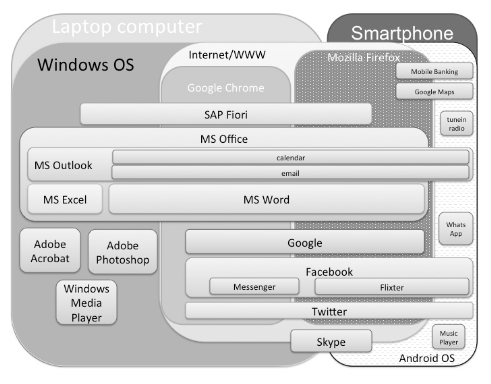

# 1.3 Ettevõtte IT-profiil

Artikli TL;TR

[Carter2015] Carter, M & Grover, V (2015) Me, my self, and I(T): conceptualizing information technology identity and its implications. MIS Quarterly.
s

Intrigeeriv teooria sellest, et arvutikasutus, "netisolek" on tasapisi muutunud inimese identiteedi (enesepildi) lahutamatuks osaks (kasutan Facebooki, järelikult olen)

---

1 töötaja

| rakendus, seade või artefakt | milleks kasulik | näide |
|------------------------------|-----------------|-------|
| e-post                       | suhtlus         | 
| stiilijuhend (_Style Guide_) | |
| Todo-tarkvara | töö kavandamine, täitmise jälgimine | |

[Carter2015]

2..10 töötajat

11..50 töötajat

51..2000 töötajat

__Tehnoloogiate kombineerimine__ e kooskasutamine on süsteemide ehitamisel hädavajalik.

Mõiste

__Tehnoloogiapinu__ (_technology stack_) on protsessi, lahenduse või keskkonna loomiseks väljavalitud tehnoloogiate (või tehnoloogiaid teostavate tööriistade, tarkvararakenduste või teenuste) kogum. Tehnoloogiapinus olevad tehnoloogiad peavad üksteisega "rääkima", moodustades toimiva, efektiivse ja väärtustloova terviku. Pinu kokkupanek võib olla strateegilise kaaluga otsus.

Näide

[Uber techstack](http://techstacks.io/uber); 
[MEAN](http://mean.io/), "an opinionated fullstack javascript framework" koosneb 4 osatehnoloogiast: MongoDB, Express, AngularJS, Node.js; [LAMP](https://en.wikipedia.org/wiki/LAMP_(software_bundle)), populaarne veebiarenduspinu: Linux, Apache HTTP server, MySQL, PHP.

Näide

Käesoleva väikese veebisaidi tegemisel on kasutatud 15 erinevat töövahendit ja tehnoloogiat:

  - [Markdown](https://en.wikipedia.org/wiki/Markdown) - laialtlevinud märgendkeel
  - [GitHub](https://github.com/) - versioonihaldustarkvara
  - [Git Bash](https://git-scm.com/downloads) - Git versioonihalduse tööriist
  - [Jekyll](https://jekyllrb.com/) - staatilise veebisaidi generaatorrakendus
    - [Kramdown](https://kramdown.gettalong.org/syntax.html) - Jekylli preprotsessor (eeltöötleja)
  - [HTML5](https://www.w3.org/TR/html5/) - universaalne veebikeel
  - [CSS3](https://www.w3.org/standards/techs/css#w3c_all) - veebi kujunduskeel
  - [Sass](http://sass-lang.com/)
  - [Liquid](http://shopify.github.io/liquid/) - templiidikeel
  - [YAML](http://yaml.org/) - lihtne märgendkeel
  - [Sublime Text 3](http://docs.sublimetext.info/en/latest/index.html) - programmeerija tekstiredaktor
    - [GitSavvy](https://github.com/divmain/GitSavvy) - tekstiredaktori Sublime Text 3 ja Giti lõimetis
  - [asciiFlow]() - lihtne jooniste redaktor
  - [Google Material Design ikoonid](https://material.io/icons/)
  - [Google Fonts](https://fonts.google.com/)

Järeldus

Organisatsioonis kasutatakse tüüpiliselt arvukalt erinevaid infotehnoloogiaid.

Järeldus

Organisatsioonid tüüpiliselt omavad vaid ebaselget ülevaadet oma tehnoloogiakasutusest.
