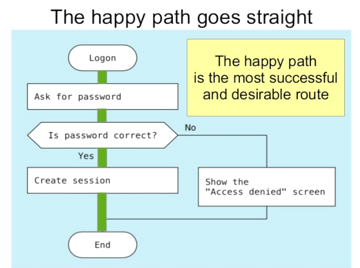
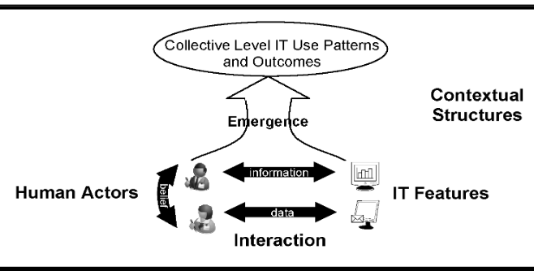

# 3.1 IT-põhine äriprotsessi (-teenuse) disain
{: .no_toc}

*TOC
{:TOC}

*Allikas: DRAKON visuaalne modelleerimiskeel*{: .s}

Oskused

- oskab kirjeldada, modelleerida suvalist äri-, töö-, teenindus- või tarbimisprotsessi (AS IS)
- oskab leida protsessi parendusvõimalusi
- oskab leida protsessis IT rakendamise (automatiseerimise, inimese töö IT-ga toetamise) võimalusi
- oskab kujundada (disainida) äri- või tööprotsessi

## Protsess

__Protsess__ on rühm tegevusi (protsessi samme), mis on suunatud ühe eesmärgi saavutamisele. Näiteks: toote valmistamine, uue töötaja töölevõtmine, tellimuse täitmine.

*Iga tööd saab vaadelda protsessina.*{: .u} Et organisatsiooni töö toimub protsesside näol, siis saab tööd paremaks teha just protsesside täiustamisega.

## Protsessiliigid

(See on oluline, sest protsessi olemust mõistmata võib selle "informatiseerimine" kasu asemel kahju teha).

__Lineaarne protsess__ - protsess, mille põhiparameetrid püsivad täitmisel stabiilsetena. Nt: standardne menetlus riigiasutuses või standardne, lihtne teenuse osutamine. __Mittelineaarne protsess__ - protsess, mille olulised parameetrid muutuvad täitmise käigus. Iseloomulik tagasiside (_Feedback_) ja teabe järk-järguline avanemine. Nt: firma käivitamine (_Startup_), tarkvaraarendus (agiilse metoodika järgi), propaganda. Masstootmise ajastust lähtunud, tänapäevalgi laialt kasutatavad protsessianalüüsi, -disaini ja parenduse meetodid on suuresti eeldanud protsesside lineaarsust. Mittelineaarsete protsesside puhul need meetodid hästi ei toimi.

__Korduv protsess__ - täidetakse mitmeid kordi, samade või erinevate osalistega; __ühekordne protsess__. Korduval täitmisel on oluline __õppimine__; õppimine võib olla mittelineaarne protsess (_Learning Curve_).

__Kliendi(teenindus)protsessid__ (_Customer-Facing_, _Front Office_) ja __siseprotsessid__ (_Back Office_).

Lisame ka tehnilisi, masinate poolt täidetavaid protsesse.

__[Taustaprotsess](https://en.wikipedia.org/wiki/Background_process)__, taustatöö, _daemon_, _job_ - arvutis jooksev protsess, mis töötab kasutajale nähtamatult ja ilma kasutaja sekkumiseta.

__Koristusprotsess__, _Garbage Collection_, programmi täitmise käigus tekkinud, enam mittevajalikku mälu koguv ja uuesti kasutusse andev taustaprotsess. (Koristusprotsess võib koguda ka kasulikku teavet - _Harvester_ on protsess, mis käib läbi veebisaite ja kogub teavet.)

Ettevõte = kogum protsesse.

## Tüüpilised probleemid protsessiga

- Ebapiisav ettekujutus protsessi toimimisest

- Ebapiisav ettekujutus sellest, kuidas protsess peaks toimima

- Vead protsessi sammude täitmisel

- Ei tehta <u>ennetavaid tegevusi</u> (nt. seadmete hooldus, töö planeerimine, tarnijate tausta kont­roll)

- Mittevajalikud tegevused, kaod, ressursside liigne kulutamine

- Kõikuvus protsessi sisendites (nt. tooraine kõikuv kvaliteet)

- Kõikuvus protsessi väljundites (toote või teenused taseme kõikumine).

Näide

Klienditeenindusprotsessi analüüs kaubandusettevõttes. 

Protsessi kirjelduse seos töötajate tasustamise süsteemiga. Tegevuse edukust määravad kriitilised tegurid (iga sammu juures). Protsessi mudel kui töötajate koolituse plaanimise vahend ja koolitusmaterjali kokkupaneku üks aluseid.

## Protsessi lihtsus

E-ühiskonna arenedes on eriti oluliseks saanud protsessi lihtne läbitavus.

Näide

Kullerteenust kavandanud tudengid jõudsid järeldusele, et tellimuse andmiseks on vaja 4 sammu. Üritasid, kuid ei saanud 3 sammuga. 5-6 sammu puhul on juba suur oht, et potentsiaalne klient jätab tellimise katki.

Näide

Ühendkuningriigis on väga jõuliselt arendatud kliendikeskset, IT-le ja parimatele, uutele erasektori praktikale põhinevat avalike teenuste osutamist (riigi elektroonilist suhtlust kodanikuga). *Kõigi*{: .u} e-teenuste osutamist [mõõdetakse 4 mõõdikuga](https://www.gov.uk/service-manual/measuring-success): e-teenuse kasutajate %, kasutaja rahulolu, e-teenuse alustatud kasutamise lõpuleviimise %, transaktsiooni maksumus. Eestis on sarnast suudetud ainult mõnes asutuses (Maksu- ja Tolliamet).  

# Miks protsessi kujundamine?

Miks peab protsessi analüüsima, kirja panema? Kasvõi sellepärast, et tahan oma töö kiiresti ära teha ja liikuda teiste tööde või huvitavamate asjade juurde.

IT-põhise protsessi tunnusjooned: 

- Ühetaoline teostamine. IT-põhist protsessi saab samal viisil teostada erinevates kohtades, erinevatel aegadel.
- Jälgitavus. Tegevust ja sündmusi saab jälgida reaalajas. See avab seninägematud võimalused testimiseks ja tagasisideks.
- Jõustatavus (_Enforceability_). IT abil saab tagada, et protsessi täidetakse kindlal viisil.

Allikas: McAfee, Brynjolfsson (2008) That Makes a Competitive Difference. Harvard Business Review.

## Protsessi parendamise metoodikad

[US Digital Services Playbook](https://playbook.cio.gov/) on hästi lihtsas keeles, annab kiiresti ülevaatlikud, kasulikud juhised.

## Protsessikaevandamine

Allikas: Nan, N (2011) Capturing Bottom-Up Information Technology Use Processes: A Complex Adaptive Systems Model. MIS Quarterly.

## Viis astet protsessi täiustamiseks

1. Saada protsessi tegelikust toimimisest õigesti ja põhjalikult aru.

2. Tõsta protsessi veakindlust.

3. Õgvendada ja kiirendada protsessi.

4. Mõõta ja vähendada protsessi kõikuvust.

5. Muuta parendamine jätkuvaks.

## Aste 1: Protsessi mõistmine

- Kuidas töö käib?

- Mida protsess peab välja andma?

- Kes on protsessis kliendid?

- Mida kliendid soovivad?

- Milline on parim teadaolev viis protsessi läbiviimiseks?

Oluline on ühtne terminoloogia. Protsessiga kokkupuutuvad töötajad (täitjad, sidusprotsesside täitjad) ei tohiks rääkida omavahel haakumatutes terminites.

Üks peamisi abivahendeid protsessi mõistmisel on protsessi kirjeldamine. Protsessi kirjeldami­ne (modelleerimine) ei ole eesmärk omaette. Kirjeldust on otstarbekas esitada nii skeemina kui ka tekstina, nii, et need üksteist täiendaksid.

__Protsessi skeemi või joonise__ koostamisel on mitmeid eeliseid:

- Üksik töötaja näeb tavaliselt ainult temasse otseselt puutuvat protsessi osa, protsess kui tervik jääb nähtamatuks. Vaja on ühiselt nähtavat pilti.

- Kui protsessi joonis koostatakse töörühmas ühiselt, siis tekib ühine arusaamine protsessi sammudest ja nende järjekorrast, algus- ja lõpp-punktidest, sisenditest ja väljunditest, klientidest ja tarnijatest.

- Protsessi joonis võib dokumenteerida senist seisundit, enne muutuste tegemist. Väljundi mõõtmine enne ja pärast muutusi aitab näidata parendusi ja võimalikku kulude kokkuhoidu.

- Saab märgata üleliigseid samme, hinnata väärtust, mida iga samm lisab.

- Protsessi kirjeldus on uute töötajate väljaõpetamise vahendiks.

*Kuidas protsessi kirjeldada?*{: .u}

Protsessi kirjeldamise meetodeid on palju. Hea kirjeldusviis peaks andma kirjeldusi, mis on:

- paindlikud, muudetavad

- kiiresti haaratavad

- tekitatavad ja muudetavad vahetult rühma töö ja arutelu käigus

- piisavalt suured (füüsiliselt) analüüsimiseks korraga kogu rühma poolt

- professionaalse esteetikaga, sõltumata koostajate käekirjast ja joonistamisoskusest.

Hea esitusviis peab olema ka lihtne, odav ja kergelt õpitav. Nendele nõuetele vastab teiste seas nn. seinatehnika.

*Leia ebakõlad, mittehaakumised, too välja ilmsed probleemid.*{: .u} Protsessi kirjeldust või mudelit uurides ilmneb pea alati probleeme, mida ei ole märgatud, kuid mida saab suhteliselt kergesti lahendada.

*Leia klientide vajadused, samuti protsessis osalejate vajadused.*{: .u} Oluline on keskenduda protsessi otstarbele. Enamasti on protsessil kindel klient või klientide rühm. Kuid olulised on ka protsessi täitjate vajadused. Vaimne ja füüsiline hügieen tööprotsessis. Töökeskkond.

*Kavanda soovitav, standardne protsess.*{: .u} Peaaegu alati on võimalik protsessi täiustada. Standardus tähendab seda, et kõik töötajad hakkavad kasutama ühtsustatud töövõtteid. Selle tulemuseks on tavaliselt toote või teenuse kva­li­tee­ditaseme tõus.

## Aste 2: Tõsta protsessi veakindlust

Selgita välja vead. Millised vead tekivad protsessi sammudes? Mõtle, mis võib protsessi sammu juures minna valesti. Hakka koguma andmeid vigade kohta. Tee protseduurid veakindlamaks.

Kaaluda:

- Kas sammude järjekorra muutus ei väldiks vigu?

- Kas info organisatsiooni või esituse muutusega (dokumendivormi, veebilehe struktuuri muutmisega) ei saaks vigu vältida?

- Kas kontrollnimistu (__Checklist__) ei väldiks vigu?

- Kas selged, graafiliselt kujundatud ning silmatorkavalt välja pandud juhised ei väldiks vigu?

- Võib-olla saab kavandada põhimõtteliselt erineva protseduuri, mis on rohkem veakindel?

- Kas seadmete, töökohtade, kaustade paigutuse muutus ei aitaks vigu vältida?

- Kas vea vältimist või avastamist ei saa arvutile anda?

## Aste 3: Õgvenda ja kiirenda protsessi

- Millised protsessi sammud ainult kõrvaldavad eelmistel protsessi sammudel tehtud vigu? Kas protsessis eespool tekkivaid vigu ei saaks vältida?

- Kas protsessis on samme, mis on põhjustatud ainult liiga suurest, põhjuseta ettevaatusest või usaldamatusest? Kas saaks midagi teha usaldamatuse kõrvaldamiseks?

- Kas protsessi kõik sammud annavad tootele või teenusele midagi juurde? Kas saab mõne sam­mu lihtsalt ära jätta, kahjustamata toote või teenuse väärtust? Protsessidel on omadus aja jooksul kasvada, muutuda keerukamaks. Sammud, mis ei ole enam vajalikud (ei lisa väär­tust), jäävad liiglihaks sisse.

- Millised on vaheladude suurused ja ooteajad protsessi sammude juures? Kas ja kuidas neid saaks vähendada? Kui palju kulub aega tellimuse andmisest tarne teostamiseni? Kas see aeg rahuldab klienti?

## Aste 4: Mõõda ja vähenda protsessi kõikuvust

Iga protsessi väljund kõigub (varieerub) mingil määral. Harva on võimalik kõikumist täielikult kõrvaldada. Kuid harilikult on võimalik kõikuvust vähendada.

Vaata, kus erinevad tingimused või protseduurid viivad erinevate tulemusteni.

- Kas üksikute töötajate töö kvaliteet erineb?

- Kui suur on vahe kogenud ja uute töötajate jõudluse vahel?

- Erinevatest seadmetest põhjustatud erinevused protsessi tulemustes?

- Erinevad mõõtmisvahendid? Erinevad kontrollijad? Erinevad materjalid?

- Erinevad toimimistingimused?

Milliseid erinevusi võib kõrvaldada? Näiteks väljaõpe ning juhendid võivad vähendada erinevusi operaatorite või inspektorite tulemuslikkuses. Tarnijate hoolikam valik võib vähendada protsessi sisendite kõikuvust.

Eksperimenteerimise vajalikkus.

## Aste 5: Tee täiustamine protsessi juhtimise püsivaks osaks

- Kas protsessis on tagasivaatava analüüsi ja/või auditi sammud?

- Kas väljaõpe ja täienduskoolitus protsessis vajalike oskuste osas on järjepidev?

## Ohud

Protsesside kirjeldamisel võib ette tulla raskusi, sh.:

- analüüsi ja tegutsemise eraldatus (uuritakse ja analüüsitakse, kuid tulemusi ei kasutata, et midagi muuta)

- vastupanu muutustele

- pealiskaudsus

- kriitiliste piirkondade vältimine, keskendumine sellele, mis on ohutu ja mugav.

Ei ole ühte, õiget ja täielikku protsessikirjeldust. Võimalikud on erinevad vaatepunktid.

*Tegevuste korduvus ja ainulaadsus.*{: .u}

- Sageli korduvad tegevused

- Harvemini korduvad tegevused

- Erandjuhud (võib eristada erandjuhte, mida suudetakse ette näha ja selliseid, mida ei suudeta ette näha).

- Rutiinsed tegevused

- Tegevused, milles iga juhtum on milleski erinev

- Unikaalsed (ainukordsed) tegevused.

Tihti arvatakse, et mõni tegevus on ainulaadne (igal konkreetsel juhul erinev) ja seetõttu ei ole võimalik või ei oma mõtet tegevust kirjeldada ja analüüsida. Sageli eksitakse ka tegevuse esinemissageduse hindamisel.

*Oma protsessi kirjeldamine (viis aspekti protsessi kirjeldamisel).*{: .u}

1. Mis on? (oma kogemus) >> Töölõigu kirjeldus - nii nagu on

2. Võrdlus teiste ettevõtetega. Koguda infot ja analüüsida: Kuidas tehakse teistel? >> Töölõigu kirjeldus - nii nagu on teistel (teiste kogemus)

3. Võrdlus standarditega/nõuetega, sh. kvaliteedisüsteemi kirjeldusega Millised on nõuded? >> Nõuded - nii nagu on nõutud

4. Teooria. Võrdlus teooriaga, kirjandusega jms. >> Teooria soovitused - nii nagu peaks olema

5. Oma ideed ja arendused >> Oma ideed - nii nagu ise mõtleme

*Kõige ülalesitatu tegemine nõuab aega.*{: .u}

Arenduseks eraldatud ressursside otstarbeka kasutamise vajadus. Ressursside suunamise võimalikud põhimõtted:

- esmalt parendada neid protsesse või protsessi samme, kus on kõige suuremad riskid

- parendada neid protsessi samme, kus investeeringu tootlus on suurim

- alustada parendamist sealt, kus on kõige kergem alustada.

## Protsessiuuendus

_Process Innovation_, äri-, töö- või tarbimisprotsessi paremaks muutmine. Infotehnoloogial ja infokorraldusel on protsessiuuenduses tähtis roll. Uued infotehnoloogiad võivad võimaldada:

- protsessi geograafilise ulatuse suurendamist (nt saab võimalikuks osutada teenust teisel mandril olevale kliendile)

- protsessi sellist kiirendamist, mis tähendab protsessi kvalitatiivset (olemuslikku) muutumist (nt avalduse töötlemise aja vähenemine kahelt nädalalt kahele tunnile)

- toodete ja teenuste kvalitatiivselt uut spetsialiseerumist ja kliendile kohandamist (nt seniseid standardtooteid saab osta konkreetsele kliendile kohandatult) (mass customisation, personaliseerimistehnoloogiad)

- tõsta protsessi täpsust või teisi kvaliteediomadusi niivõrd, et tehnoloogia või lõpptoode muutub atraktiivseks ja kasutatavaks

- koostööd ja koordinatsiooni, mis varem ei olnud võimalik; tänu sellele on töökogumeid võimalik jagada väiksemateks tööpakettideks; spetsialiseerumise võimalus ja läbi selle – parema kvaliteedi ja efektiivsuse saavutamine

- väärtusahelast laiema osa mõjutamine (nt nn kiire reaktsiooniga tarnesüsteemid kaubanduses).

## Keskkond

- Stabiilses keskkonnas (nt. riigiasutus, mille funktsioon on selgelt välja kujunenud ja muutused ülesannetes, sotsiaalses ja tehnoloogilises keskkonnas on aeglased – tänapäeval on selline organisatsioon kindlasti erandiks) ei ole protsesside uuendamine oluline.

- Turumajanduses: riskimise, proovimise vajadus.

- Edukas käitumine (efektiivsed protsessid) selekteeritakse välja.

- Kohanemise ja teerajamise dialektika. Ettevõte peab ühest küljest kohanema turu nõudlusega; teisest küljest – peab ka üritama muuta turu reegleid (uute turgude loomine uute toodete läbi).

## Protsesside täiustamine ja organisatsiooni kultuur

Erinevused töökultuuris on nii riikide, firmade kui ka tegevusalade vahel. Võrdle erinevusi Saksa, Eesti, Vene, Soome töökultuuride vahel.

Näide. Rahvusvaheline kontsern käivitas ühes Ida-Euroopa riigis tehase, importides tehase juhtkonna Lääne-Euroopast. Viie aasta möödudes oli kavas ettevõtte juhtkond välja vahetada kohapealse vastu. Investeerimisekspertide hinnangul vähendas selline perspektiiv ettevõtte turuväärtust (ennustati ettevõtte turuosa vähenemist juhtimiskompetentsi languse tõttu).

Eestis on protsessiuuendus suhteliselt nõrgal tasemel? Parem on olukord rahvusvahelistes firmades, kus on lihtsam oskusteavet välismaalt Eestisse üle kanda. Suhtumine: töö protsess on suuresti töötaja enda mure (palgatakse ootusel, et ühelt poolt on palk, teiselt poolt tööülesannetega iseseisvalt hakkama saamine).

## Inimtegevuse infotugi

Inimtegevuse infotugi infokäitluse parendamise stra­teegiana väärib kindlasti omaette vaatlust. Projekteerida (kavandada) prot­sess ning panna inimene se­da täitma on ainult üks suund. Efektiivse tulemi saamiseks tuleb lähtuda ka ini­mesest. Individuaalsed erinevused (inimese individuaalsus). Prot­ses­sikeskses infotöötlussüsteemis on inimesed ja arvutid ettemääratud protsesside täitjad.

Ini­mese­kesk­selt ülesehitatud süsteemis navigeerib inimene (vahel väga infoküllases) informatsioonilises keskkonnas suhteliselt vabalt. Keskpunkti muutus protsessilt inimesele annab sageli täiesti erineva üles­ehi­tu­se. [Näited] Inimese tahtevabadust või vähemalt käitumise olulist vari­ee­ru­vust eeldatakse. Mida tähendab see infotoe arendajatele? Süsteemid, prog­ram­mid ja infotooted peavad pakkuma funktsionaalsuse valikulise, mitmeviisilise ka­su­tamise võimalust. [Näited]

__"Infokorilus"__, _Information Foraging_ — kütluse-koriluse taasilmumine inforikkas ühiskonnas. Kahte liiki probleeme: a) informatsioonilise keskkonna kujundamine; b) selles keskkonnas efektiivne liikumine.

IT süsteemide erinevad liigid võivad eelistada kas prot­sessikeskset või ini­me­se­keskset struktuuri. Infoarhitektuuri suund on selles mõttes pigem inimese­keskne kui protsessikeskne.

