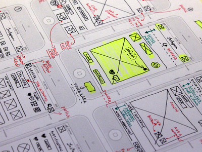

# 3.1 IT-põhine äriprotsessi (-teenuse) disain

*[Mino Parisi](https://dribbble.com/shots/1743039-Instagram-paper-wireframe?list=searches&offset=2)*{: .s}

Oskused

- oskab kirjeldada, modelleerida suvalist äri-, töö-, teenindus- või tarbimisprotsessi (AS IS)
- oskab leida protsessi parendusvõimalusi
- oskab leida protsessis IT rakendamise (automatiseerimise, inimese töö IT-ga toetamise) võimalusi
- oskab kujundada (disainida) äri- või tööprotsessi

__Protsessiliigid__

__Lineaarne protsess__ - protsess, mille põhiparameetrid püsivad täitmisel stabiilsetena. Nt: standardne menetlus riigiasutuses või standardne, lihtne teenuse osutamine. __Mittelineaarne protsess__ - protsess, mille olulised parameetrid muutuvad täitmise käigus. Iseloomulik tagasiside (_Feedback_) ja teabe järk-järguline avanemine. Nt: firma käivitamine (_Startup_), tarkvaraarendus (agiilse metoodika järgi), propaganda. Masstootmise ajastust lähtunud, tänapäevalgi laialt kasutatavad protsessianalüüsi, -disaini ja parenduse meetodid on suuresti eeldanud protsesside lineaarsust. Mittelineaarsete protsesside puhul need meetodid hästi ei toimi.

__Korduv protsess__ - täidetakse mitmeid kordi, samade või erinevate osalistega; __ühekordne protsess__. Korduval täitmisel on oluline __õppimine__; õppimine võib olla mittelineaarne protsess (_Learning Curve_).

__Kliendi(teenindus)protsessid__ (_Customer-Facing_, _Front Office_) ja __siseprotsessid__ (_Back Office_).

Lisame ka tehnilisi, masinate poolt täidetavaid protsesse.

__[Taustaprotsess](https://en.wikipedia.org/wiki/Background_process)__, taustatöö, _daemon_, _job_ - arvutis jooksev protsess, mis töötab kasutajale nähtamatult ja ilma kasutaja sekkumiseta.

__Koristusprotsess__, _Garbage Collection_, programmi täitmise käigus tekkinud, enam mittevajalikku mälu koguv ja uuesti kasutusse andev taustaprotsess. (Koristusprotsess võib koguda ka kasulikku teavet - _Harvester_ on protsess, mis käib läbi veebisaite ja kogub teavet.)

Ettevõte = kogum protsesse.

E-ühiskonna arenedes on eriti oluliseks saanud protsessi lihtne läbitavus.

Näide

Kullerteenust kavandanud tudengid jõudsid järeldusele, et tellimuse andmiseks on vaja 4 sammu. Üritasid, kuid ei saanud 3 sammuga. 5-6 sammu puhul on juba suur oht, et potentsiaalne klient jätab tellimise katki.

Näide

Ühendkuningriigis on väga jõuliselt arendatud kliendikeskset, IT-le ja parimatele, uutele erasektori praktikale põhinevat avalike teenuste osutamist (riigi elektroonilist suhtlust kodanikuga). *Kõigi*{: .u} e-teenuste osutamist [mõõdetakse 4 mõõdikuga](https://www.gov.uk/service-manual/measuring-success): e-teenuse kasutajate %, kasutaja rahulolu, e-teenuse alustatud kasutamise lõpuleviimise %, transaktsiooni maksumus. Eestis on sarnast suudetud ainult mõnes asutuses (Maksu- ja Tolliamet).  

Miks peab protsessi analüüsima, kirja panema? Sest:

- tahan oma töö kiiresti ära teha ja liikuda teiste tööde või huvitavamate asjade juurde

[US Digital Services Playbook](https://playbook.cio.gov/) on hästi lihtsas keeles, annab juhised.

McAfee, Brynjolfsson (2008) That Makes a Competitive Difference. Harvard Business Review

The Elements of a Successful IT-Enabled Process

Given the costs of enterprise IT and the risks inherent in deploying it poorly, it’s especially important that the change projects you select capitalize on IT’s strengths. Consider the following hypothetical example of a company that did just that. A U.S. furniture maker sells both standard and custom pieces out of its 100 showrooms nationwide. Because salespeople in each of the showrooms have very little direct interaction with or information about the company’s three factories, they all quote long lead times for custom furniture, just to be on the safe side. To rectify this situation, the company develops software to integrate the activities of manufacturing and sales, and tests it at one location. Now salespeople can enter the specifications of a custom order and instantly receive an accurate delivery date. The company also decides to use the software to manage customer deliveries. The delivery team for the test showroom is required to call back to the dispatch center immediately after leaving a customer’s house. That enables the center to contact the customer to verify his or her satisfaction and address any concerns. The software tracks delivery times and satisfaction levels and finds the former is decreasing while the latter ticks upward. Recognizing its success, the company quickly embeds the new process in its enterprise software and rolls it out to the other 99 locations. Because customers value these process innovations, the company’s market share grows nationwide. Successful IT-enabled business process improvements like this one generally have a number of important characteristics: They cover a wide span. The new ways of working apply across a very large swath of a company – in this case, all stores, factories, and delivery teams. They produce results immediately. As soon as the new enterprise system goes live, so do the process changes it enables.
They are precise, rather than general guidelines, suggesting highly scripted instructions for business activities (furniture order taking and delivery). They are consistent – executed the same way everywhere, every time. Every furniture store uses the same method to quote lead times, and deliveries are closed out the same way day after day. They make monitoring easy. Activities and events can be observed and tracked in real time, providing unprecedented opportunities for testing and feedback. They build in enforceability. The designers of a new process that’s embedded in IT can have great confi dence that it will be executed as intended. It is often simply impossible to execute the process the old way, and even when backsliding is possible it can be recognized and addressed. The furniture company could easily use the data collected during the delivery process to determine if all teams were calling in properly.
