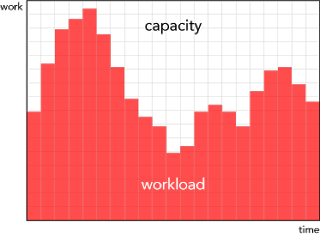

# 4.8 IT töökindlus ja turve
{: .notoc}

*TOC
{: toc}

<i class='material-icons ikoon' style='color: #9C27B0;'>group_work</i>
Kuidas tagada IT-süsteemide tõrgeteta toimimine? Tehnilisem, kuid ärilisest vaatest vajalik teema.

## Mis on töökindlus?

> "Learn to work with average people." -- -- [The outwork myth](https://m.signalvnoise.com/the-outwork-myth-4cd6536c225#.7dp1f59my) (vt [ka teisi](https://m.signalvnoise.com/tagged/greatest-hits) Jason Friedi (Basecamp-i asutaja) tavapärastele juhtimisseisukohtadele oponeerivaid kirjutisi).

Sõnavara

**_fallback_**, 1) varuvariant; 2) taandeolek, normaalset ajutiselt asendav (väiksemate võimalustega) varukonfiguratsioon või -tööviis

**_latency_**, 1) peitaeg, latentsusaeg, latentsuse kestus, sh süsteemi reaktsiooni hilistus; 2) hilistuslik või näiline puudumine

**_throughput_**, läbilaskevõime; jõudlus, mingis ajavahemikus sooritatud töö mõõt

**_failover_**, automaatne ümberlülitumine varuseadmele tõrke korral; **_switchover_**, sama, kuid käsitsi

Allikas: [Cary Millsap (2015) The Fundamental Challenge of Computer System Performance](http://carymillsap.blogspot.com.ee/2015/09/the-fundamental-challenge-of-computer.html)
{: .s}

## Tõrkekindluse saavutamise meetodid

Tõrkekindluse saavutamise peamised meetodid on:

1. komponentstruktuur
2. iga komponendi kohustus arvestada teise komponendi tõrketüüpidega ja neid võimaluste piires mõistlikult käsitleda (kinni püüda, avastada, mitte edasi anda kolmandatesse moodulitesse, saata monitooringumärguanne (_Alert_) jne)
3. iga komponendi kohustus produtseerida oma tegevuse kohta logiteavet
4. iga komponendi kohustus produtseerida enda kohta health check teavet
5. _Failover_

Tõrketoimete analüüs [Failure Mode and Effects Analysis](https://en.wikipedia.org/wiki/Failure_mode_and_effects_analysis) on üks vanemaid ja tuntumaid süsteemide töökindluse analüüsi ja planeerimise meetodeid.

Näiteks ühe tehnilise süsteemi tõrkeanalüüs (vt lisas).

Tõrkeanalüüsiks on mitmeid meetodeid (vt nt [Pumfrey, D (1999) The Principled Design of Computer System Safety Analyses ](http://www-users.cs.york.ac.uk/~djp/publications/Thesis16.pdf).

## Tõrkekindluse praktiline saavutamine

Võib-olla piisab, kuid ülalnimetatud põhimõtted on välja öeldud ja arendaja neid arvestab. Ja kui on probleem (kuidas probleem avastatakse?), siis helistatakse üksteisele ja uuritakse logidest.

Kas oleks vaja süstemaatilisemat, tervikut vaatavat tõrkeanalüüsi?

Näide

Meil (riigiasutuses) on ISKE (infoturbe meetmete süsteem), MFN (mittefunktsionaalsed nõuded tarkvarale), riskianalüüs (rohkem projektijuhtimise vaatest), TEHASes (ITIL-i põhises teenuste haldamise süsteemis) mainitakse vist ka Ishikawa kalaluustiku-diagrammi.

Testimine on küll olnud süstemaatiline, kuid arusaadavalt ei kata kõiki võimalikke tõrketüüpe.

Praegu meil ei ole ka teada, et selliseid analüüse (_Reliability Engineering_) muudele süsteemidele oleks tehtud.

Põhjalikum tõrkeanalüüs on keeruline ja töömahukas.

Alustuseks tuleks käideldava kõik komponendid, ka paigalduskeskkond ja kasutatavad välised teenused ja süsteemid kirja panna. See aga eeldab korralikku arhitektuuridokumenti. Kui saame arhitektuuridokumendid korda, siis saavad vajadusel võimalikuks ka terviklikumad tõrkeanalüüsid.

## Kirjandus

Raamatu TL;DR

[Murphy R (2016) Site Reliability Engineering](https://landing.google.com/sre/book.html)

Google'i insenerid jutustavad, kuidas nad tagavad süsteemide töökindluse. Tehniline, kuid väga õpetlik käsitlus.

Artikli TL;DR

Sústrik, M () [ZeroMQ](http://www.aosabook.org/en/zeromq.html)

Tehniline käsitlus sõnumijärjekorra (_Message Queue_) tarkvara ehitusest, millest erilist tähelepanu väärib läbilaskevõime (_Throughput_) ja latentsuse (_Latency_) käsitlus.

[Millsap, C (2010) Thinking Clearly About Performance. Communications of the ACM.](http://method-r.com/papers?download=44:thinking-clearly-paper)

## Lisa. DHX adapterserveri tõrkeanalüüs

*Metoodika*{: .u}. Lähtudes DHX adapterserveri üleantud dokumentatsioonist ja koodist, koostasin komponentide nimekirja ja panin kirja rea tõrketüüpe ning nende avastamisviise. 

*Leiud*{: .u}

| nr | komponent | funktsioon | tõrketüüp (Failure Mode) | avastamine
|----|------|------|--------|-------|
| 1  | rakendusserver (Apache Tomcat) | jooksutab DHX adapterserveri tarkvara | 1  põhimälu saab täis; 2  rakendusserver v masin jookseb kokku | avastatakse monitooringus | 
| 2 | X-tee poolsed adapterserveri komponendid | | |
| 2.1 DHX Vastuvõtja | | 1  ei võta dokumenti vastu; 2  võtab vastu valesti v vale dokumendi | vastuvõtmised logitakse; vajadusel saab logisid uurida; probleem peab aga välja tulema muu kanali kaudu(kuidas?) |
| 2.2 | DHX Saatja | 1  ei saada dokumenti välja; 2  saadab valesse kohta või vale dokumendi; 3  saadab sama dokumendi kaks korda | saatmised logitakse;
vastuvõtja peab tegema duplikaatide kontrolli |
| 2.3 | DHX Aadressiraamatu uuendaja | | 1  ei uuenda; 2  uuendab valesti | Aadressiraamatut, mis on pikka aega uuendamata, kas ei tuleks kasutada või haldurile teada anda |
| 2.4 | Failisüsteemi ja andmebaasi puhastaja | perioodiline töö, mis kustutab adapterserveri puhvrist edastatud dokumendid | 1  kustutab saatmata dokumendid või DHSi edastamata dokumendid; 2  jätab mittevajalikud dokumendid kustutamata | Ühtlasi kustutatakse ka dokumendid, mida  (kordusüritustele vaatamata) ei õnnestunud edastada. Puhastamisest tuleks koostada ja haldurile esitada raport. Kas puhastamise tulemusi tuleks logida? |
| ... | ... | ... | ... |

*Hinnang*{: .u}. Osa tõrgetevastaseid meetmeid on sisse ehitatud DHX protokolli. Näiteks peab vastuvõttev süsteem kontrollima, kas tegu pole sama dokumendi uuestisaatmisega. DHX adapterserveris lisab keerukust see, et adapterserver realiseerib sisuliselt hübriidprotokolli – X-tee poole räägib DHX-i, DHS-i poole pakub vana DVK liidese alamhulgale sarnast protokolli.

Arendaja on DHX adapterserveris teostanud põhimõtteliselt kaks tõrkekindlust tõstvat meedet: Java Spring soovitatud ja JMX health check väljundid monitooringusüsteemi ja logimise.

Logid on mõeldud kasutamiseks siis, kui avastatakse, et midagi on sassi või valesti läinud. Probleemide avastamiseks (näiteks, et dokument jäi saatmata või vastu võtmata, kustutati ekslikult jm) logid ilma täiendava analüüsivahendita tõenäoliselt palju abi ei paku. Probleemide avastamiseks oleks kasulik, kui DHX adapterserver pakuks haldajale statistikat (nt kui palju perioodilisel puhvri puhastamisel kustutati dokumente, mida korduvale üritamisele vaatamata ei õnnestunud edastada).

Programmeerija on ilmselt ka sisse kirjutanud erindite töötlemise failisüsteemi poole pöördumisel jms. Seda siis lokaalses vaates.

Tõenäoliselt on tehtud komponentidevahelisi kontrolle. Näiteks DHX Saatja (komponent) peaks lokaalse aadressiraamatu kasutamisel kontrollima, kas see on uuendatud (DHX Aadressiraamatu uuendaja võib tõrkuda). See eeldab selget komponentstruktuuri. 

Käsitletud on ka klastrisse paigaldamise/failover-i teemat.

