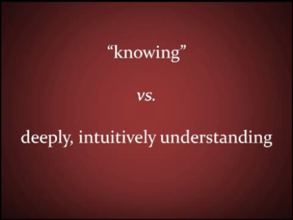

# 1.4 Tehnoloogiatrendide jälgimine
{: .no_toc}

- TOC
{:toc}

<i class="material-icons ikoon">help_circle</i>Mis asi on <i>Design Thinking</i>? Kas peaksime IT-s seda kasutama?

Oskused

- teab IT-trende käsitlevaid kvaliteetseid infoallikaid
- omab ettekujutust uue IT rakendamise hetkeseisust ühes valitud ärivaldkonnas.

## Tehnoloogia mõistmine

...ei ole kerge.

> "Make sure you understand the problem you are solving. Even a problem as simple as "make it fast" can take lot of work to understand properly." -- Martin Sustrik (_Message Queue_ tarkvara ekspert)

[Blow, J (2011) Programming Aesthetics learned from making independent games](https://youtu.be/JjDsP5n2kSM) (YouTube, 36:00)

__Tehnoloogia__ algses, antiik-Kreekast pärit tähenduses on oskus või kunst midagi produktiivset teha (kr τέχνη, techne, "oskus, kunst"; -λογία, -logia).

Seetõttu on natuke tautoloogiline rääkida tehnoloogia rakendamisest. Tehnoloogia ongi see, kuidas tehakse.

Tarkvara kontekstis võib tehnoloogia tähendada suhteliselt spetsiifilisi asju. Näiteks [autocomplete](https://en.wikipedia.org/wiki/Autocomplete) ja [vihjesisestus](https://twitter.github.io/typeahead.js/examples/) on suhteliselt lihtsad ja väikesed, kasutajale võib-olla märkamatukski jäävad kasutajaliidese tehnoloogiad, mis siiski kasutajamugavust suuresti tõstavad.

__Infotehnoloogia__ (IT) on üldnimetus väga suurele tehnoloogiate perekonnale.

## Tehnnoloogiatrend

Kõik muutub - ka IT. IT arenguprotsess: üldiseloomustus.

- tööstusinternet, _industrial internet_
- [The Debate Around “Do We Even Need CSS Anymore?”](https://css-tricks.com/the-debate-around-do-we-even-need-css-anymore/)

__Tehnoloogiatrend__ on uue, paljulubava tehnoloogia tulemine, populaarsuse võitmine.

__Tehnoloogia reklaamlause__, [tagline](https://en.wikipedia.org/wiki/Tagline) on lühike lause, fraas või ka ainult sõna või tähtlühend, mis esitab kokkuvõtlikult, löövalt ja atraktiivselt uue tehnoloogia "lubaduse". Nt `Connected Everything`. 
__Tehnoloogia reklaamlause__, ([tagline]()) on lühike lause, fraas või ka ainult sõna või tähtlühend, mis esitab kokkuvõtlikult, löövalt ja atraktiivselt uue tehnoloogia "lubaduse". Nt `Connected Everything`. 

__Software Defined Everything__

Uute IT-trendide ja märksõnade voog näib katkematuna.

- _Factory of the Future (FoF)_
- asjade internet, _Internet of Things (IoT)_
- "nutilinnad", _Smart Cities_
- nutikodu, _Smart Living Environment_
- iseliikuvad autod
- kehal kantav IT, _Wearable IT_
- _[Cyber Physical Systems](https://en.wikipedia.org/wiki/Cyber-physical_system)_
- nutivõrk, _Smart Grid_
- _Digital Innovation Hubs_
- _Silo-breaking (research and innovation practices)_
- _Non-Centric Architectural Thinking_
- _Blockchain_
- _Software Defined Everything_
- _Personal Data Spaces_
- _Beyond IP_ (IP siin _Intellectual Property_, mitte _Internet Protocol_ tähenduses)
- _Smart Anything Everywhere_
- _Disappearing Computers_
- _[Fog and Edge Computing](http://readwrite.com/2016/08/05/fog-computing-different-edge-computing-pl1/)_ (ei ole kuulnud, tõsiselt!)
- _Post-Human_
- _Fake News_
- _Robot-Based Innovation in Services_
- _Innovation Ecosystems_
- _Accessible To Everyone, Anytime On Any Device_
- _Emotional Monitoring_
- _Multi-Platform Scenarios_
- _Disruptive usages of smart objects and digital companions_
- aktiivne vananemine, _Active Ageing_
- _Seamless services and experiences_
- _Lifestyle Management_
- _Person as a Platform (PaaP)_
- _Connected Everything_
- Journey to new marketplace
- Creating amazing value
- Keeping everything up to date and in sync

1990ndatel oli nimekiri tagasihoidlikum:

- _Information at Fingertips_
- _Total Information Management_
- _Seamless Integration_
- _Information at the Point of Need_
- _Fully Integrated Enterprise_
- _Glue that holds the company together_
- _Company's nervous system_ (B Gates)
- _Anytime, anywhere_
- _Information Society_

1980ndatel:

- reaalajatöötlus, _Real-Time Processing_

Trendide moodustamine: -põhine, -ülene, -keskne.

__Tehnoloogia lubadus alati ei täitu__.

Lihtne, kergekaaluline (_lightweight_), laiendatav - need on omadused, millega infotehnoloogiaid väga sageli välja pakutakse.

SOAP (Simple Object Access Protocol) on lightweight; XML (Extensible Markup Language) on laiendatav; mõlemad tehnoloogiad on laialt levinud, kuid tänapäevasest vaatest mitte kõige lihtsamad ega ka laiendamise poolest kõige paremad.

__Tehnoloogia arengu lõputus?__ Tähelepanuväärne on Venemaa majandusteadlase [Glazjevi](https://en.wikipedia.org/wiki/Sergey_Glazyev) nn pikkade lainete teooria, vt ["Majandusarengu pikkade lainete tänapäevane teooria"](http://www.glazev.ru/upload/iblock/77b/77b8141cdfc1038b78520f79fc9acd40.pdf). Glazjev väidab, et igal sajandil on olnud oma domineeriv tehnoloogiline formatsioon (vn уклад). IT tormiline areng nihkuvat teisele plaanile, IT asemele tõusvat juhtrolli biotehnoloogia jt uued suunad. 

# Tehnoloogiate jälgimine

__Tehnoloogiatrendide jälgimine teenusena__.

- [Redmonk](http://redmonk.com/), "the developer-focused industry analyst firm"
- [ThoughtWorks Technology Radar](https://www.thoughtworks.com/radar)
- [O'Reilly Ideas](https://www.oreilly.com/ideas)
- [Gartner](http://www.gartner.com/technology/home.jsp)
- [Cisco Radar](https://techradar.cisco.com/)

__Mudelid__. Igal uuringufirmal on oma meetod või mudel, millega tehnoloogiasuundi analüüsitakse ja ennustatakse ning tehnoloogiapakkujaid hinnatakse.

- Tehnoloogiauuringute firma Gartner [The Magic Quadrant](http://www.gartner.com/technology/research/methodologies/research_mq.jsp) jagab turul tegutsevad tehnoloogiapakkujad visiooni ja teostusevõimekuse järgi 2x2 tabelisse:

  - __liidritel__ on hea visoon ja nad suudavad seda ka ellu viia
  - __visionääridel__ on selge nägemus, kus suunas turg liigub või kuidas turgu muuta, kuid nad ei suuda seda veel teostada
  - __nišimängijad__ on edukad väikeses turusegmendis, neil puudub plaan laiemaks tegutsemiseks
  - __mahajääjad__ (ingl _challengers_) teostavad praegu hästi (_execute well_), kuid neil ei näe arusaamist turu liikumissuunast.  

- [Forrester Wave](https://www.forrester.com/marketing/policies/forrester-wave-methodology.html) on süstemaatiline, laborikatsetusi ja küsitlemist kombineeriv arenevate tehnoloogiate (ingl _emerging technologies_) (ja tehnoloogiaturgude) hindamise meetod.

- Uuringufirma Gartner [Hype Cycle](https://en.wikipedia.org/wiki/Hype_cycle) on laialt tuntud tehnoloogia kasutuselevõtu mudel.

__Soovitusi IT jälgimiseks__. - Kõige uuemat, ülikasulikku teavet leiab blogidest, mitte raamatutest

> [..] check out latest articles on techie websites [..] &mdash;[Slava Akhmechet](http://www.defmacro.org/)

- Twitter

> Twitter is a good tool for staying up-to-date with web development. Start with famous JavaScript people you know (e.g., the creator of your framework of choice) and continue from there; sooner or later, you will get plenty of ideas for whom to follow next. &mdash;[Axel Rauschmayer](http://speakingjs.com/es5/ch33.html)

