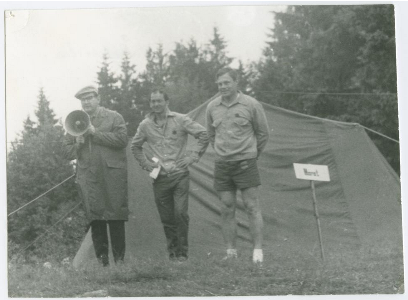

Versiooniuuendus

Aasta võis olla 1985. Olin just lõpetanud TPI (praeguse TTÜ) ja asunud samas tööle noorema teadusliku töötajana, palgaga oli vist 120 rubla kuus. Diplomitöö teemaks oli professor Leo Võhandu pakkunud uurida programmeerimiskeelt Forth. Forth on primitiivne, masinakeelele väga lähedane programmeerimiskeel. Mäletan, et Forth-keelne programm töötas üheainsa pinuga, vahetulemusi sinna salvestades ja edasistes arvutustes uuesti välja võttes. See jäi meie kui majandusinformaatikute erialast suhteliselt kaugele. Olime ju viis aastat õppinud majandusliku informatsiooni mehhaniseeritud töötlemise organiseerimist (selline oli eriala nimetus). Prof Võhandu saatis mind Küberneetika Instituuti Mati Räbovõitra juurde. Räbovõitra oli markantne mees, kes ajalooannaalidesse on jäänud millegipärast tolleaegsete arvutuskeskuste kokkutulekute "peoloomana" [1]. Kapitalismist võisime tollal lugeda ainult ajalehest, akadeemilisest kapitalismist (L. Lapini termin) polnud aga keegi kuulnudki. Küberneetika Instituut ei asunud TPI õppekorpustest kaugel. Külastasin Mati Räbovõitrat, ta rääkis mulle, et Forthi programmid nõuavad väga vähe põhimälu ja jooksevad ka väga primitiivse riistvara peal. Seetõttu kasutatakse Forthi seadmetes, mis "kusagil lendavates masinates". Sõjatööstusest ei tohtinud tollal sõnagi rääkida. Küberneetika Instituudis tegeldi ka "Elbrus" superarvutitega. Nüüd teame, et neid kasutati, võib-olla kasutatakse tänapäevalgi raketi- ja aatomirelvasüsteemides.

Käik Räbovõitra juurde jäi ainsaks. Diplomitöö kirjutasin hoopis teisel teemal. Üks kokkupuude aga mul Forth keelega hiljem siiski oli. Noorema teadusliku töötajana saadeti mind Moskvasse Forthi uut versiooni tooma. Andres Lomp, hiljem loonud firma IE Tarkvara, mis tegutseb tänapäevalgi, andis mulle flopiketta. See oli uuemat sorti, 5-tolline, ümbrikus, painduvast plastikust ketas. Lähetuskorraldus, avanss, rongiga Moskvasse. Rongi hommikul kohale jõudes hakkasin instituuti, kust pidin uue versiooni saama, otsima.  Teadusliku uurimise instituut asus Moskva kesklinnas, suure elumaja alumisel korrusel ühes korteris olid sektsiooni ruumid. Esimeses toas oli laua peal personaalarvuti. Värvilise kuvariga välismaine personal computer. See oli siis veel suur haruldus. Arvuti taga istus suurt kasvu noorem mees ja mängis arvutimängu. Teine elas kõrval kaasa. Kuvaril jooksis ringi mingi karvane troll, ajas palle taga ja imes need vjuuuuuuuut! oma sure toruja koonuga endale sisse. Mind juhatati tagumisse tuppa. Seal kohtusin lühemat kasvu noore mehega, kes osutus selleks, keda otsisin. Noor mees istus laua taga ja kirjutas pastapliiatsiga paberile. Ta rääkis mulle, et on ka nooremteadur ja kirjutab kandidaadiväitekirja. Väitekirja teema oli freimi-põhise ja objekt-orienteeritud modelleerimise ühendamine. Freimid olid 1980-ndate algul populaarne tehisintellektisuund. Teise laua taga istus naistöötaja. Temal olid lauanurgal mõned hoolikalt kokkupandud froteerätikuted. Sisenes veel üks naine. Naised hakkasid froteerätikuid katsuma ja elavalt arutama. Sain aru, et tegu oli asutusse saabunud defitsiitse kaubaga, mida ametiühing nüüd pidi õiglaselt laiali jagama. Ootasime, kuna arvutit mängiv mees pausi tegi ja saime arvuti juures minu flopikettale uue versiooni peale kopeeritud. Kopeerimine käis lihtsalt, sest PC-l oli kaks flopiseadet. Ühte pandi originaal, teise sihtketas. Mis seal uues versioonis oli ja kas seda keegi Küberneetika Instituudis ka kasutas, ma ei tea. Varsti hakkas Nõuk. Liit ja sellega koos ka sõjatööstus koost lagunema.

Tagantjärele olen mõelnud, et need kolm kohatud inimest väljendasid päris selgelt "arenenud sotsialismi" stagneeruvas ühiskonnas kolme võimalikku toimetulekustrateegiat. Mõned lõid tööl aega surnuks. (Eesti arvutuskeskustes tollal töötanud inimesed on rääkinud, et mängiti bridži). Teised tegelesid materialistlike küsimuste lahendamisega, oma heaolu suurendamisele, niipalju, kui selleks kasinaid võimalusi oli. Kolmandad üritasid teha teadust.

See oli siis. Nüüd on kõik teisiti. Uues ühiskonnaversioonis ühed võib-olla töötavad end surnuks. Eks selliseid ole igal ajal. Teised leiavad väljundi reisimisest. Kolmandad pühenduvad materialistlike küsimuste lahendamisele. Huvitaval kombel leidub ka aja surnukslööjaid. Aja surnukslöömise vormid on alati rafineeritud. Mõned üritavad teha teadust. 

Arvutuskeskuste kokkutulek Kose-Uuemõisas, vasakult: dots. L. Võhandu, grupijuht M. Räbovõitra, grupijuht T. Lume, 1974.a.

[1] 1970ndatel   arendati   Nõukogude   Liidus   ulatuslikku   „automatiseeritud   süsteemide”  rajamise kampaaniat. 1970ndate lõpus tegutses Eestis poolsada arvutuskeskust kuue tuhande töötajaga. Kui üleliiduline juhtimisstruktuur 1980ndate aastate teisel poolel kokku varises, kaotasid need süsteemid mõtte ning neid teenindavad  arvutuskeskused likvideeriti   järk-järgult, millele aitas kaasa personaalarvutite laialdane sissetung. -- Vegmann, E () Riigi Infosüsteemi Ameti kujunemine ja ülevaade tegevusest. Tartu Ülikooli lõputöö, lk 7. 
