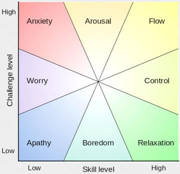

# 2.2 Sujuv töövoog (Streamlined Workflow)

Märkus. See teema vajab veel põhjalikku läbimõtlemist. Kas tegu on pelgalt metafooriga, [psühholoogilise seisundiga](https://en.wikipedia.org/wiki/Flow_(psychology)) või millegi sügavamaga?

Vt ka [4.8 IT töökindlus ja turve](/Tookindlus).

<i class="material-icons ikoon">help_circle</i>Kas võite oma organisatsioonist tuua näite projektist, tegevusest või tööst, mis sujub või sujus väga hästi?

__[Töövoog](https://en.wikipedia.org/wiki/Workflow)__ (_Workflow_) 

<i class="material-icons ikoon">help_circle</i>Kas teie organisatsioonis kasutatakse töövoo mõistet? Millises töölõigus võiks töövoo selgem kokkuleppimine kõige kiiremat efekti anda? Kas organisatsioonis on tarkvara, mis seda töövoogu toetaks? Kas suudate töövoo joonisena või samm-sammulise tegevuste loeteluna visandada?
 

Töövoosüsteemid (_Workflow Engine_)

Tarkvara

[JIRA](https://www.atlassian.com/software/jira) on IT-organisatsioonides populaarne töövoosüsteem. [Building an awesome JIRA workflow: concepts and examples](https://blogs.atlassian.com/2013/10/building-workflow-awesome/) õpetab töövoo projekteerimist.

__Töövoo visualiseerimine__ on töövoosüsteemide hinnatud omadus. Laialt kasutatakse __kanban__-laudu.

Tarkvara

[Microsoft Flow](https://flow.microsoft.com/et-ee/) on äriprotsesside automatiseerimise tarkvara, millega saab seostada üle 80 erineva rakenduse. Näiteks saab e-postkastist panna sissetulevad kirjad liikuma müügiinfosüsteemi jms. Eesti keeles ja kontseptsioonilt huvitav, kuid süsteem paistav olevat veel ebaküps. Vanem samalaadne süsteem on [Zapier](https://zapier.com/).

# Sujuv (Lean) IT

Sujuvust (ingl _smooth_) võib defineerida kui mittevajaliku vältimist tööprotsessis. Tootmiskorralduse terminoloogias - töösoleva produkti (ingl _work-in-progress_, WIP) minimeerimist.

Engineering culture: Spotify [http://vimeo.com/85490944]() [http://vimeo.com/94950270]()

[Sublime Text 3 Snippets](https://webdevstudios.com/2016/08/16/snippets-saved-life-how-sublime-text-3-snippets-changed-everything/)

Also

- [The Most Graceful Freestyle Swimming by Shinji Takeuchi](https://youtu.be/rJpFVvho0o4)
<!-- - [Alexander Popov swimming technique](https://youtu.be/CIzBaSiWdRA) -->

