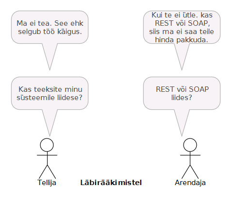

# XKCD-stiil (diagrammimismeetod)

Reeglid:

- aktor (inimene) - "kriipsujukudena", roll tekstina all
- inimene ütleb midagi (emotsionaalselt) - jutumull
- inimene mõtleb midagi - mõttemull 

[xkcd](https://xkcd.com/) on veebis järjena ilmuv populaarne IT-koomiks.

